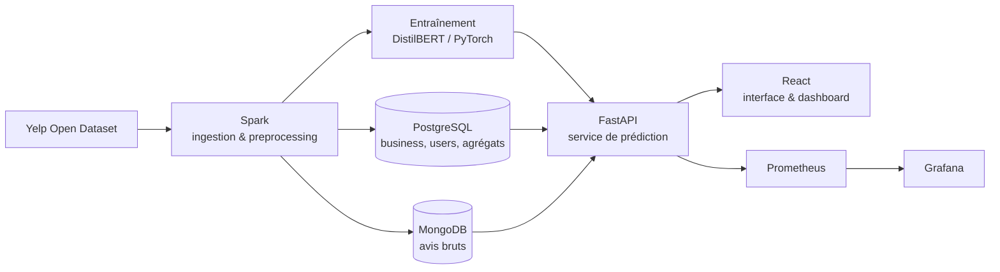

# Yelp Sentiment — Analyse de sentiment sur avis en ligne, de l'ingestion au déploiement monitoré

Service qui prédit le sentiment (ou la note) d'un avis client à partir de son texte, grâce à un modèle de deep learning. Un pipeline big data traite les données en amont, une API et une interface légère exposent le modèle, et un monitoring suit la production en aval.

## Données

**[Yelp Open Dataset](https://www.yelp.com/dataset)** : gratuit, plusieurs millions d'avis, ~7 Go.

Chaque caractéristique du dataset justifie un choix technique :

| Caractéristique | Conséquence technique |
|---|---|
| Volume (plusieurs millions d'avis) | Preprocessing distribué avec **Spark** |
| Texte libre des avis | Modèle **NLP / deep learning** |
| Entités relationnelles (`business`, `user`) | Stockage **SQL** (PostgreSQL) |
| Avis au format JSON semi-structuré | Stockage **NoSQL** documentaire (MongoDB) |
| Relation user ↔ business | Système de recommandation (extension possible) |

Fichiers principaux : `business.json`, `review.json`, `user.json`.

## Architecture

## Stack et rôle de chaque composant

| Composant | Rôle |
|---|---|
| **Spark** (sur HDFS) | Ingestion et preprocessing du volume : nettoyage du texte, feature engineering, agrégations par business et par utilisateur |
| **PostgreSQL** | Données structurées : business, users, notes agrégées |
| **MongoDB** | Avis bruts en documents JSON, éventuellement embeddings |
| **PyTorch** | Modèle principal : transformer (DistilBERT) fine-tuné pour la classification de sentiment |
| **scikit-learn** | Baseline de comparaison (TF-IDF + modèle linéaire) |
| **FastAPI** | Backend : sert les prédictions et les requêtes vers les bases |
| **React** | Frontend léger : saisie d'un avis, prédiction affichée, dashboard des sentiments agrégés |
| **Docker** | Conteneurisation de chaque service |
| **Kubernetes** | Orchestration du déploiement multi-conteneurs (API, bases, frontend) |
| **Prometheus + Grafana** | Métriques de l'API (latence, erreurs) et suivi de la dérive du modèle |
| **GitHub Actions** *(optionnel)* | CI/CD |
| **MLflow** *(optionnel)* | Tracking des expériences |

## Roadmap

### v1 — cœur fonctionnel et déployé
- [ ] Exploration du dataset et définition des schémas SQL / NoSQL
- [ ] Preprocessing Spark
- [ ] Baseline scikit-learn
- [ ] Fine-tuning DistilBERT et comparaison avec la baseline
- [ ] API FastAPI de prédiction
- [ ] Conteneurisation Docker
- [ ] Déploiement

### v2 — industrialisation
- [ ] Frontend React et dashboard
- [ ] Orchestration Kubernetes
- [ ] Monitoring Prometheus / Grafana et détection de dérive
- [ ] CI/CD GitHub Actions
- [ ] Tracking MLflow

## Installation

*À compléter.*

## Résultats

*À compléter : métriques de la baseline et du transformer.*